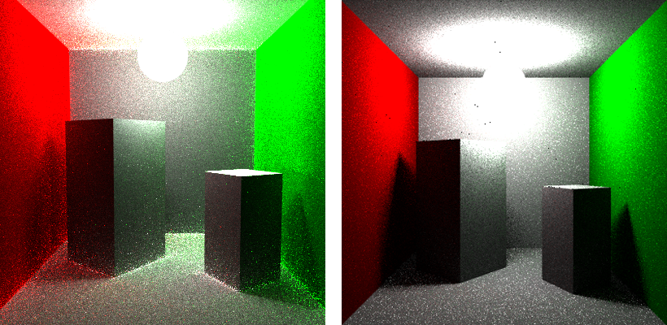
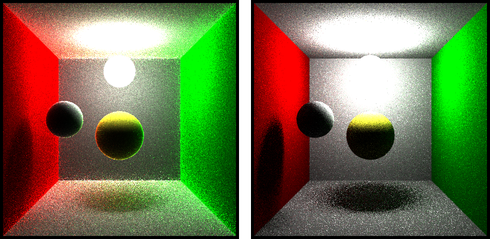
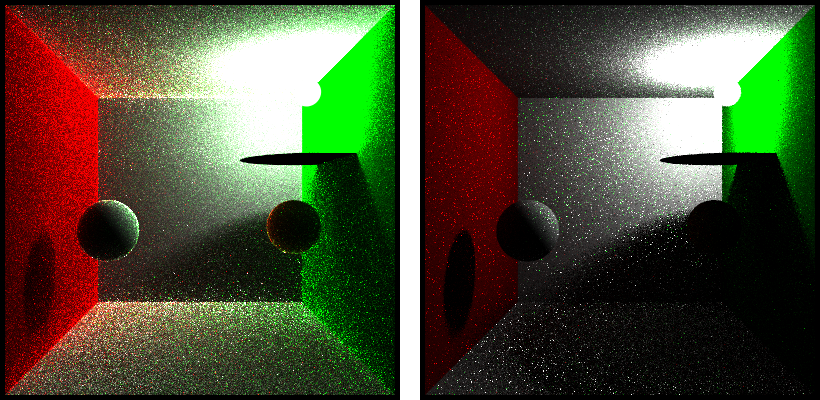
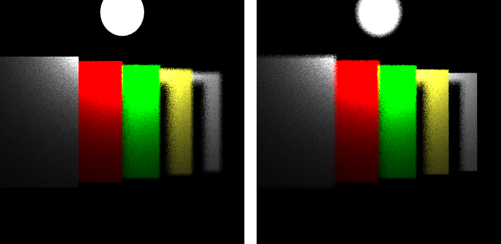
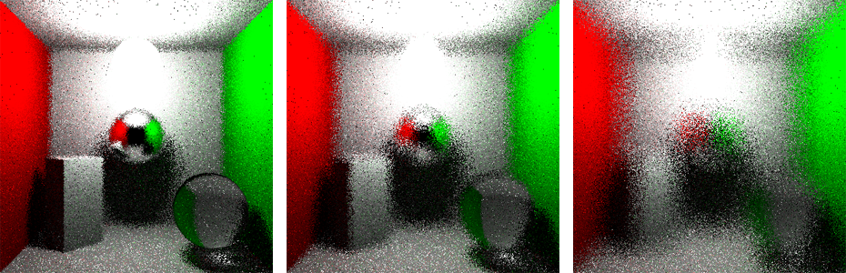

# Graphics_BidirectionalPathTracer

The final porject of CIS 560 Computer Graphics. 
Major features include **BDPT**,  **Progressive Rendering**, **Depth of Field** and **heuristic BVH acceleration**.

## Bidirectional Path Tracer Implementation
<figure align="middle">
  
  <figcaption><em>Fig1. Bidirectional path tracer(left) vs MIS path tracer(right).</em></figcaption>
</figure>
 
<figure align="middle">
  
  <figcaption><em>Fig2. Bidirectional path tracer(left) vs MIS path tracer(right).</em></figcaption>
</figure>
 
<figure align="middle">
  
  <figcaption><em>Fig3. Bidirectional path tracer(left) vs MIS path tracer(right).</em></figcaption>
</figure>
From the obove pictures, bidirectional path tracer performs better in dealing with the in
uences
between adjacent geometries. And also have a better rendering in scenes where lights are obstructed
by geometry.
 

## Heuristic BVH Acceleraiton
Some test scenes are rendered with acceleration structure-bvh tree.
BVH took 3221ms to render a scene with 33K triangles and 1 sample per pixel.
<figure align="middle">
  
  <figcaption><em>Fig4. Heuristic BVH test - building.</em></figcaption>
</figure>
 
<figure align="middle">
  
  <figcaption><em>Fig5. Heuristic BVH test - wahoo &amp; building.</em></figcaption>
</figure>
 

## Progressive Rendering
Implemented a new OpenGL shader to render the texture grabed from frame buffer to screen. And update the rendered texture in each render thread.
<figure align="middle">
  
  <figcaption><em>Fig6. Screenshot of <b>progressive rendering</b>.</em></figcaption>
</figure>
 

## Depth of Field
Add *lensRadius* and *focalLength* variables to Camera class, sample camera.eye within a disc with radius: *lensRadius*. Then modify the reference point to focal plane. Cast a newRay by variables
above.
<figure align="middle">
  
  <figcaption><em>Fig7. Depth of field. <b>long focal length(left) </b> vs <b>short focal length(right)</b></figcaption>
</figure>
 
<figure align="middle">
  
  <figcaption><em>Fig8. Depth of field. <b>smaller lens radius(left) </b> to <b>bigger lens radius(right)</b></figcaption>
</figure>
 

## Transmissive material
<figure align="middle">
  
  <figcaption><em>Fig9. Transmissive and reflective material.</em></figcaption>
</figure>
 