# Graphics_BidirectionalPathTracer

The final porject of CIS 560 Computer Graphics. 
Major features include **BDPT**,  **Progressive Rendering**, **Depth of Field** and **heuristic BVH acceleration**.

## Bidirectional Path Tracer Implementation
|Didirectional path tracer|Naive Multiple Importance Sampling|
|---------------------|----------------------------|
|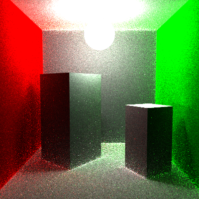|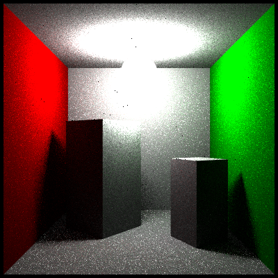|
|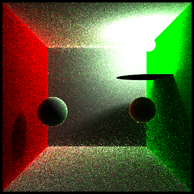|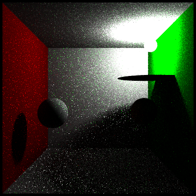|
|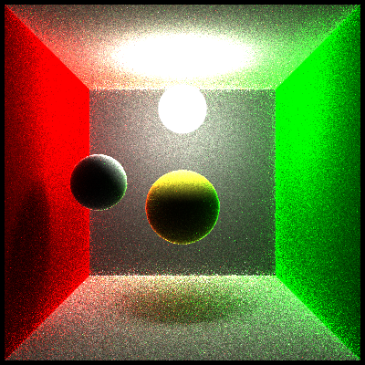|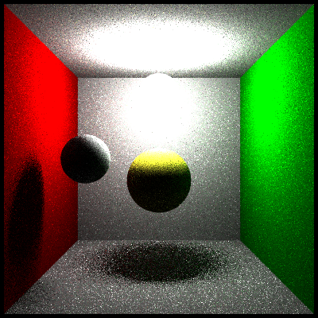|

From the obove pictures, bidirectional path tracer performs better in dealing with the influences between adjacent geometries. And also have a better rendering in scenes where lights are obstructed by geometry.
 

## Heuristic BVH Acceleraiton
Some test scenes are rendered with acceleration structure-bvh tree.
BVH took 3221ms to render a scene with 33K triangles and 1 sample per pixel.  
<em>Fig. Heuristic BVH test - building.</em> 
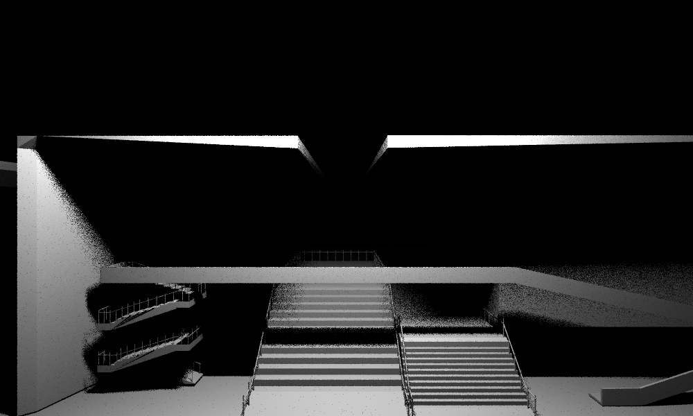
  
<em>Fig. Heuristic BVH test - wahoo &amp; building.</em> 
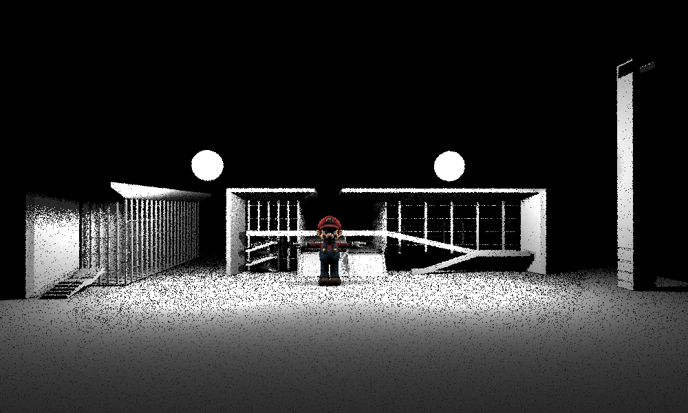
 

## Progressive Rendering
Implemented a new OpenGL shader to render the texture grabed from frame buffer to screen. And update the rendered texture in each render thread.  
<em>Screenshot of <b>progressive rendering</b>.</em> 
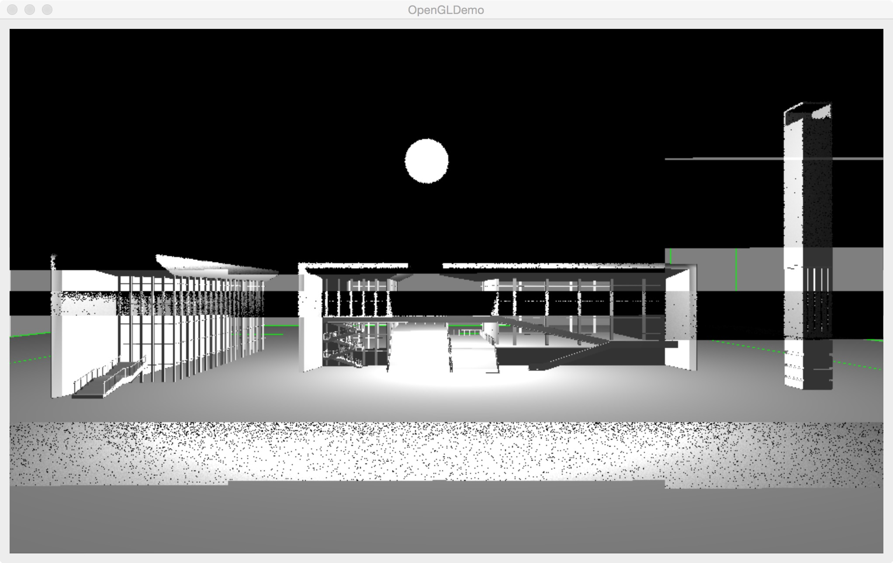
 

## Depth of Field
Add *lensRadius* and *focalLength* variables to Camera class, sample camera.eye within a disc with radius: *lensRadius*. Then modify the reference point to focal plane. Cast a newRay by variables
above. 

|long focal length|short focal lenth|
|-----------------|------------------|
|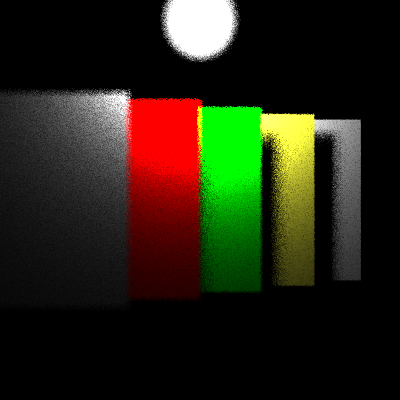||

|small lens radius|medium lens radius|large lens radius|
|-----------------|------------------|----------------|
|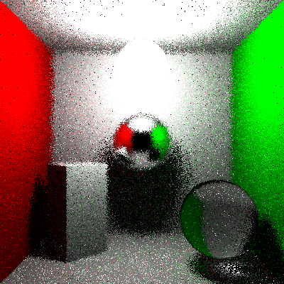|||

## Transmissive material
<em>Transmissive and reflective material renderer.</em> 

 